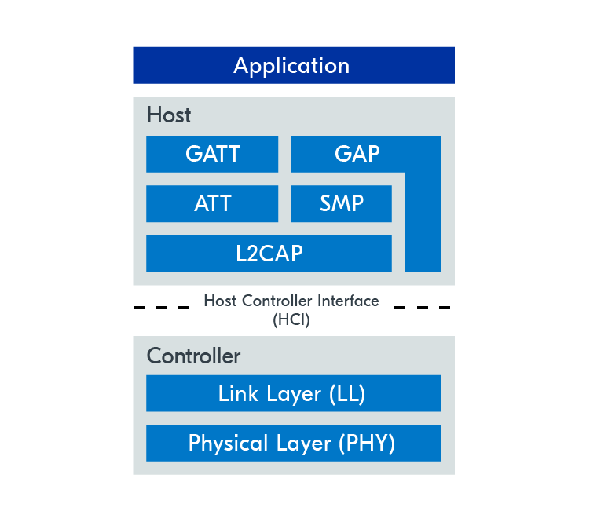
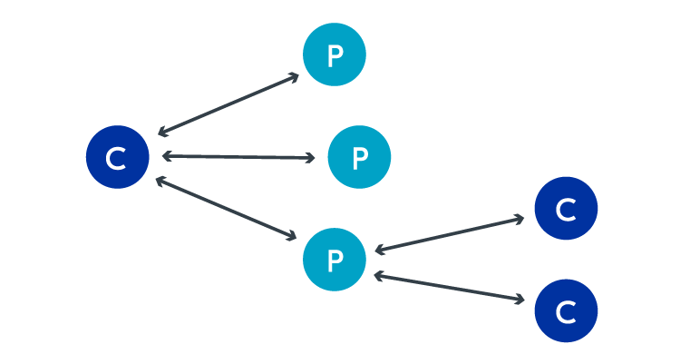
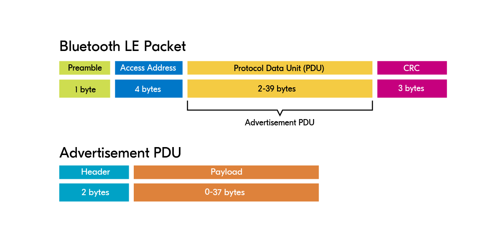
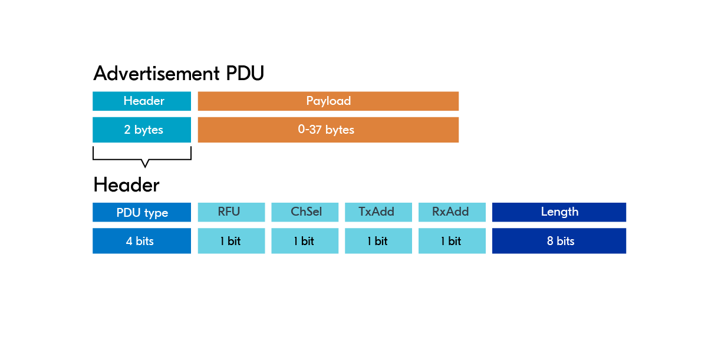
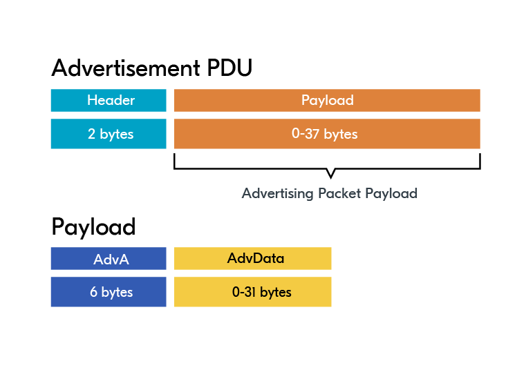
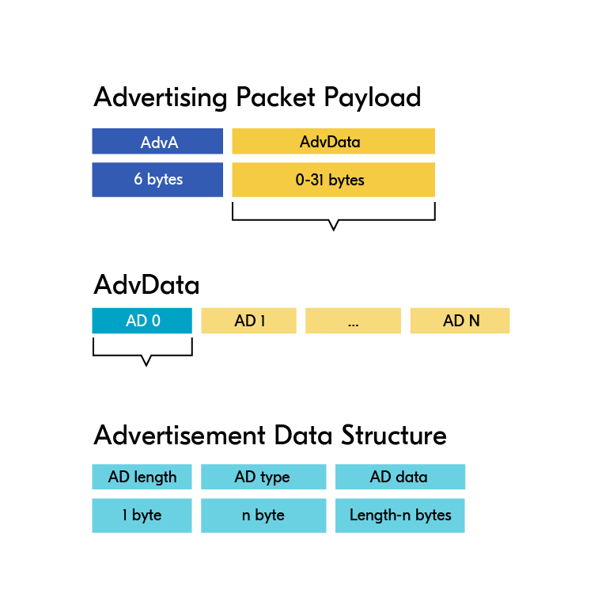
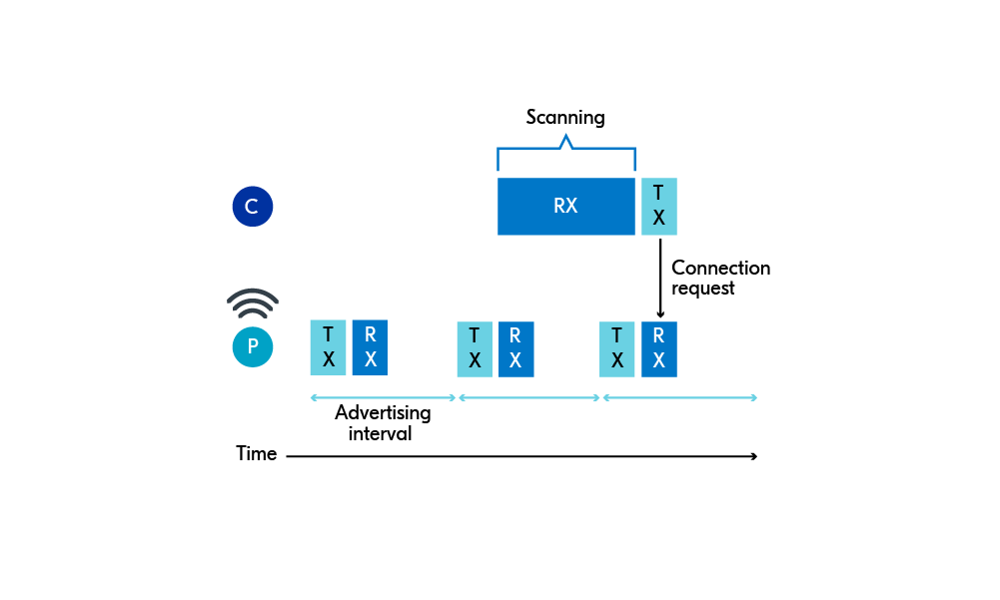
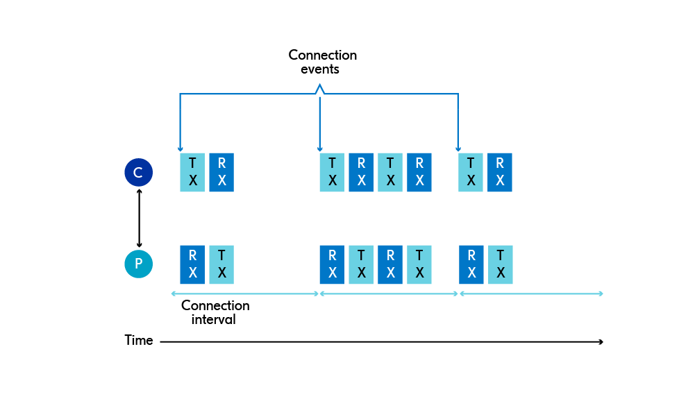
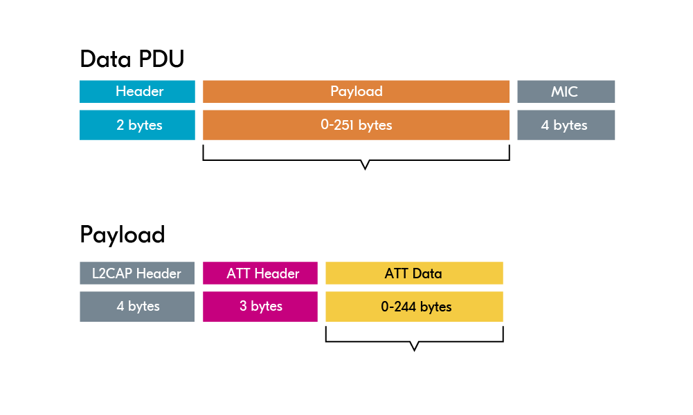

## BLE Protocol Stack

1. Application(应用层)：公司大老板 / 客户最高层
   大老板根本不关心包裹是怎么运的、用了什么卡车。他只负责下达核心业务指令：“现在用户的心率是120次/分，马上把这个数据发给手机！”
2. Host(主机层)：公司总部的“管理与文职部门”

   这一层负责逻辑、安全和打包，主要在处理信息和文件，不负责具体开车跑腿。它包含了几个关键的办公室：

   * GAP (Generic Access Profile) —— 销售与公关部：
     * **职能：** 负责“拉客”和“建立合作”。它决定了你的手环是一直在广播大喊“我在这里，快来连我！”（广播模式），还是悄悄地只和特定的手机握手（连接模式）。
   * GATT & ATT —— 档案与仓库管理部：
     * **职能：** 负责给数据贴标签、分门别类。心率数据不能随便扔，GATT 会把它规范地放进“健康数据档案柜”里的“心率抽屉”（这在蓝牙里叫 Service 和 Characteristic）。ATT 则是那个负责具体去抽屉里存取数据的档案员。
   * SMP (Security Manager Protocol) —— 安保部：
     * **职能：** 负责核对身份和包裹加密。手机连过来时，SMP 会问：“暗号是多少？”（配对/Pairing）。确认安全后，把心率数据放进密码箱，防止被别人中途窃听。
   * L2CAP (Logical Link Control and Adaptation Protocol) —— 包装分发中心：
     * **职能：** 负责把上面送来的包裹进行“拆分”和“合并”。如果大老板扔来一个超大的文件，L2CAP 会把它切成适合卡车装载的小块；同时，它也负责梳理多个部门交接来的包裹，排好队往下送。
3. HCI (Host Controller Interface) —— 内部通讯系统

   图片中间那条虚线，是公司总部（Host）和基层车队（Controller）之间的 **标准通讯接口** 。
   总部在写字楼，车队在郊区车库。HCI 就像是他们之间的“标准指令电话线”或者“快递单发货系统”。总部把打包好的数据通过 HCI 传给车队，车队也会通过 HCI 报告“包裹已送达”。
4. Controller（控制器）：基层“运输车队”

   这一层是纯粹的物理干活部门，不问包裹里是什么，只管把东西安全送过马路。

   * Link Layer (LL - 链路层) —— 车队调度员：
     * **职能：** 负责极其精确的时间管理和交通管制。他决定了卡车必须在 10:00:00 准时出发，10:00:05 准时到达。如果包裹在半路掉了（丢包），他会立刻安排重新发车补送（重传机制）。
   * Physical Layer (PHY - 物理层) —— 卡车与高速公路：
     * **职能：** 最底层的苦力。它是把数据变成 2.4GHz 无线电波发出去的硬件天线。这就好比真正的卡车开在公路上，把包裹（0和1的电信号）物理地运送到手机的接收天线那里。

### 案例：发送一次心率数据

1. **Application:** 手环测出心率 120，大老板下令发送。
2. **GATT/ATT:** 档案员把“120”放进标准的心率数据格式盒子里。
3. **SMP:** 安保部给盒子上了加密锁。
4. **L2CAP:** 包装中心给盒子贴上快递单，装进标准运输箱。
5. **HCI:** 总部通过系统通知车队：“有货要发！”
6. **LL (Link Layer):** 车队调度员安排这批货在接下来的几毫秒内按顺序上车，并盯着对方有没有签收。
7. **PHY (Physical Layer):** 无线电天线化身卡车，通过 2.4GHz 频段，把电信号飞速送到手机端。手机端再由下往上，一层层拆快递，最终在屏幕上显示出“120”。

---

## GAP: Device roles and topologies

蓝牙低功耗协议支持两种不同的通信方式：面向连接的通信和广播通信。

* 面向连接的通信：设备间建立专用连接，形成双向通信。
* 广播通信：设备间不先建立连接，而是通过广播数据包进行通信，范围内的设备均可接收到这些数据包。

广播(**Advertising**)和扫描(**Scanning**)是指蓝牙低功耗 (BLE) 设备感知彼此存在和连接可能性的过程。两个 BLE 设备要相互连接，其中一个需要广播其存在和连接意愿，而另一个则会扫描是否存在此类设备

* 广播：发送广播数据包的过程，其目的既可以是为了广播数据，也可以是为了被其他设备发现。
* 扫描：监听广告数据包的过程

发出连接请求并表明自身存在的设备充当外围设备(**Peripheral**)，而扫描广播的设备则充当中心设备(**Central**)。如果中心设备扫描到外围设备的广播数据包，则可以选择向外围设备发送连接请求来建立连接。此时，就称外围设备和中心设备之间建立了连接。

* 中心设备：一种扫描外围设备并建立连接的设备角色。
* 外围设备：一种能够向中央服务器发布信息并接受连接的设备角色。

有时设备只想广播信息，而无需与其他设备建立连接。在这种情况下，一种称为广播器(**Broadcaster**)的特殊外围设备可以发送广播数据包，但不会接收任何数据包，也不会允许连接请求。信标设备(**Beacon devices**)就是广播器的一个很好的例子。它们只传输信息，无需连接到特定设备。另一方面，一种称为观察者(**Observer**)的特殊中央设备会监听广播数据包，但不会发送连接请求来发起连接。

* 广播器：一种特殊的外部设备，它广播广播数据包而不接受任何连接请求。
* 观察者：一种特殊的中央设备，它监听广播数据包而不主动发起连接。

---

## Network topologies

1. Broadcast topology
   在广播拓扑中，数据传输无需设备间建立连接。这是通过使用广播包将数据广播给范围内所有设备来实现的。外围设备（更具体地说是广播器）广播数据，而中心设备（更具体地说是观察器）扫描并读取广播包中的数据。

   
2. Connected topology

   连通网络拓扑结构在数据传输之前会先建立连接。与广播拓扑结构不同，这种通信方式是双向的。

   
3. Multi-role topology

   单个设备也可以同时扮演多种不同的角色。例如，同一设备在一种环境下可以作为外围设备，而在另一种环境下可以作为中心设备。

   

---

## The Attribute Protocol

ATT层是蓝牙低功耗设备连接阶段数据传输、接收和处理的基础。它基于客户端-服务器架构，其中服务器保存数据，可以直接将数据发送给客户端，或者客户端可以从服务器轮询数据。

在大多数情况下，外围设备是服务器，因为它是获取和存储数据的设备。同样，中心设备通常是客户端，因为它是接收来自服务器的数据的设备。

* GATT Server:该设备存储数据并提供GATT客户端访问数据的方法。
* GATT Client:该设备通过特定的GATT操作访问GATT服务器上的数据。

ATT 层定义了一种称为属性的数据结构，GATT 服务器使用该数据结构来存储数据。服务器可以同时保存多个不同的属性。

* Attribute:由ATT协议定义的标准化数据表示格式。

---

# The Generic Attribute Profile

通用属性配置文件 (GATT) 层直接位于 ATT 层之上，并在此基础上，将属性分层分类为配置文件、服务和特征。GATT 层使用这些概念来管理蓝牙低功耗 (BLE) 设备之间的数据传输。

在客户端开始与服务器交互之前，客户端并不知道服务器上存储的属性的性质。因此，客户端首先执行所谓的服务发现，即向服务器查询这些属性。

---

## PHY:Radio Modes

1. 1M PHY
2. 2M PHY
3. Coded PHY

---

## Advertising Process

### Advertising and discovery

当低功耗蓝牙设备处于广播状态时，它会发送广播数据包来宣告自身的存在，并可能与其他设备建立连接。这些广播数据包会按照广播间隔定期发送。

* Advertising intervals:广波数据包的发送间隔。范围为 20 毫秒至 10.24 秒，步长为 0.625 毫秒。

### Advertisement channels

蓝牙低功耗 (BLE) 设备通过 40 个不同的频率信道进行通信。这些信道分为三个主广播信道和 37 个辅助广播信道。主广播信道主要用于广播目的。辅助广播信道有时也可用于广播目的，但主要用于连接建立后的数据传输。

为确保一定的冗余度，广播数据包会通过三个主要广播频道（频道 37、38 和 39）发送。同时，扫描设备会扫描这三个频道，以查找广播设备。

### Scan interval and scan window

与广播间隔类似，扫描间隔是指扫描器扫描广播数据包的频率。扫描窗口是指扫描器扫描数据包的时间，实际上代表了设备在每个扫描间隔内进行扫描与不进行扫描的占空比。

* Scan interval:设备扫描广告数据包的间隔。
* Scan window:设备在每个扫描间隔内扫描数据包所花费的时间。两者取值范围均为 2.5 毫秒至 10.24 秒，步长为 0.625 毫秒。

### Scan request and response

当外围设备广播时，中心设备还可以选择向外围设备发送扫描请求，请求广播数据包中未包含的附加信息。如果扫描请求被接受，外围设备将以扫描响应进行回复，该响应也通过三个主要广播信道传输。

* Scan request:中央设备向外围设备发送的消息，用于请求广播包中未包含的附加信息
* Scan response:作为扫描请求的响应而发送的消息，其中包含额外的用户数据

---

## Advertising types

外围设备可以通过多种方式进行广播宣传。

* Connectable vs. non-connectable:判断中央设备是否可以连接到外围设备
* Scannable vs. non-scannable:确定外围设备是否接受来自扫描仪的扫描请求
* Directed vs. undirected:确定广告数据包是否定向到特定扫描器

传统广播主要分为四种类型。

* Scannable and connectable (ADV_IND):这是最常见的广播类型。如果外围设备使用这种广播类型，则意味着它既可扫描又可连接。也就是说，外围设备会广播自身的存在，允许中心设备发送扫描请求，并以扫描响应作为回应（因此可扫描），随后建立连接（因此可连接）。
* Directed connectable (ADV_DIRECT_IND):这种类型的广播用于定向广播，广播商不接受扫描请求。它是定向的、可连接的，但不可扫描的。这种方法适用于设备已知晓扫描器位置，只想快速重新连接的情况。例如，蓝牙鼠标与电脑断开连接后，只需重新连接即可。在这种情况下，无需接受扫描请求，发送定向广告数据包可以更快地缩短连接过程。
* Non-connectable and scannable (ADV_SCAN_IND):使用此类广播的设备只会接受扫描请求，但不允许与其建立连接（因此无法连接）。
* Non-connectable and non-scannable (ADV_NONCONN_IND): 这种类型的广播既不接受扫描请求，也不接受建立连接。此类广播的典型应用场景是信标，由于信标不允许接收任何数据，因此设备无需将无线电切换到接收模式，从而降低了电池消耗。

---

## Bluetooth address

每个低功耗蓝牙 (BLE) 设备都由一个唯一的 48 位地址标识。蓝牙地址分为公共地址和随机地址。随机地址又根据其是否可变分为静态地址和私有地址。最后，私有地址又分为可解析地址和不可解析地址。请注意，随机地址和私有地址只是分类类型，并非实际的地址类型。

蓝牙低功耗设备至少使用以下地址类型之一

* Public address:该程序由制造商编程到设备中，并已在IEEE注册。
* Random static address:可在启动时配置，并在设备整个生命周期内保持不变。无需向 IEEE 注册，是公共地址的常用替代方案。
* Random private resolvable:（可选）一个会定期更改但可通过预共享密钥解析的地址
* Random private non-resolvable:（可选）一个会定期更改且无法解析的地址

---

## Advertisement packet

BLE packet structure
   

Advertisement PDU header
   

* PDU type:广播类型
* RFU:保留
* ChSel:如果支持 LE 信道选择算法 #2，则设置为 1
* TxAdd:根据发送方地址是公开的还是随机的，返回值为 0 或 1。
* RxAdd:0 或 1，取决于接收地址是公开的还是随机的。
* Length:Payload的长度

Advertisement PDU payload
   

* AdvA:广播设备的蓝牙地址
* AdvData:广播数据包

Advertising packet payload

   

广播数据包由多个称为广播数据结构（AD结构）的结构组成。每个AD结构都包含一个长度字段、一个用于指定类型的字段（AD类型）以及一个用于存储实际数据的字段（AD数据）。请注意，最常见的AD类型长度为1字节。

AD type:

* **Complete local name** (`BT_DATA_NAME_COMPLETE`):这仅仅是设备名称，用户在扫描附近设备时（例如通过智能手机）会看到这个名称。
* **Shortened local name** (`BT_DATA_NAME_SHORTENED`):完整本地名称的简短版本
* **Uniform Resource Identifier** (`BT_DATA_URI`):用于宣传 URI，例如网站地址（URL）。
* **Service UUID**:服务通用唯一标识符 (SUI) 是一个对特定服务而言唯一的通用编号。它可以帮助扫描器识别需要连接的设备。
* **Manufacturer Specific** **Data** (`BT_DATA_MANUFACTURER_DATA`):这是一种流行的类型，它允许公司定义自己的定制广告数据，例如 iBeacon。
* **Flags**:可以标记该设备特定属性或运行模式的 1 位变量

Flags:

广播标志是封装在一个字节中的一位标志，这意味着最多可以设置 8 个标志。常见的标志：

* BT_LE_AD_LIMITED：设置 LE 有限可发现模式，与可连接广播配合使用，向中央服务器指示该设备仅在广播超时前可用一段时间。
* BT_LE_AD_GENERAL：设置 LE 通用可发现模式，用于可连接广播，表明广播可长时间可用（超时 = 0）。
* BT_LE_AD_NO_BREDR：表示不支持经典蓝牙（BR/EDR）。

---
# BLE Connections

## Connection process
### Connecting
建立连接需要两个设备，一个作为外围设备，当前正在广播；另一个作为中心设备，当前正在扫描。当中心设备接收到来自外围设备的广播数据包时，即可发起连接。通常，这涉及到扫描广播数据包的内容，然后根据扫描结果决定是否建立连接。当中心节点发送连接请求时，外围节点和中心节点之间就建立了一个双向连接（面向连接的）通道。
   
如上图所示，发送可连接广播的外围设备在每次广播后都会有一个短暂的接收窗口（RX窗口），用于监听传入的连接请求。我们称之为连接请求，但实际上，外围设备无法选择接受或拒绝连接请求。除非使用了接受列表过滤器，否则它必须始终接受连接请求。之后，在任何时间点，如果它不想保持连接，可以选择断开与中央服务器的连接。

### During the connection
外围设备成功接收到连接请求数据包后，两个设备便建立了连接。连接建立后，设备将不再使用广播信道（信道 37、38 和 39），而是开始使用数据信道（信道 0 到 36）。为了减少干扰并提高连接吞吐量，低功耗蓝牙 (Bluetooth LE) 采用信道跳频技术，即频繁切换数据传输信道。这样，如果设备处于某些信道噪声较大的环境中，消息将在下一个连接间隔内通过其他信道重新传输。为确保数据完整性，所有通过低功耗蓝牙传输的数据包都会无限重试，直到收到确认或连接终止为止。

蓝牙低功耗连接的特性是这些设备能够实现如此低功耗的主要因素。在连接状态下，两个设备大部分时间都处于睡眠状态。为了实现这一点，它们会约定唤醒通话的频率。否则，它们会关闭无线电功能，设置定时器并进入睡眠状态。它们约定的睡眠时间称为连接间隔，在初始连接时设置；而连接事件则在每个连接间隔内发生，即它们唤醒通话时。

* Connection interval：连接中的两个设备唤醒以交换数据的时间间隔
* Connection event:每个连接间隔都会发生这种情况，即中心设备向外围设备发送数据包时

下图展示了一个典型的连接过程。中心设备和外围设备都会在每个连接间隔内唤醒以处理连接事件并传输数据。
   
连接间隔最初由中心节点在连接请求数据包中设定，但可以在连接过程中进行更改。如果需要发送大量数据，两个设备可以在每个连接间隔内发送多个数据包；但当它们停止发送数据时，必须等待下一次连接事件才能继续发送数据。即使没有有效数据要发送，对等节点也需要发送空数据包来同步时钟。如果要发送的数据量超过单个连接间隔所能容纳的范围，则数据将被拆分到多个连接间隔中发送。

### Disconnecting
当两个设备连接后，如果没有发生任何异常情况，它们将一直保持连接状态。连接可以通过两种方式终止，即设备断开连接。
* Disconnected by application
* Disconnected by supervision timeout

#### Disconnected by application
如果其中任何一台设备愿意，它们都可以发送终止数据包来断开连接。例如，当一台设备不再希望与另一台设备连接时，就会发生这种情况；但如果连接出现故障，也会发生这种情况。例如，如果您连接的某个设备声称之前已连接过，但它无法使用正确的加密密钥对数据包进行签名，则终止数据包将包含一个名为“断开连接原因”的字段，其中会说明设备断开连接的原因。例如，是用户主动断开连接，还是协议栈出现问题。

#### Disconnected by supervision timeout
设备断开连接的另一个原因是它停止响应数据包。这可能由多种原因造成。例如，连接设备上的应用程序崩溃并重启（这种情况并不少见，尤其是在开发阶段），连接设备的电池电量耗尽，或者连接设备超出了无线电信号范围。连接超时所需的时间由连接监控超时参数设置。

## Connection parameters
当外围设备和中心设备建立连接时，会交换一组连接参数。其中一些参数具有标准起始值（为了向后兼容），而另一些参数则由中心设备指定，并包含在连接请求数据包中。

连接间隔和连接监控超时，它们由中心设备在连接请求数据包中设置，此外还取决于外围设备的延迟。外围设备的延迟允许外围设备在没有数据要发送的情况下跳过连接事件的唤醒。

为了向后兼容，无线电模式（1M、2M 或编码 PHY）默认设置为 1M，但可以在连接过程中更改。数据长度和 MTU（最大传输单元）也为了向后兼容而设置。

### Connection interval
低功耗蓝牙设备大部分时间都处于“休眠”状态（这也是其名称中“低功耗”的由来）。在连接过程中，这是通过约定一个连接间隔来实现的，该间隔规定了设备之间通信的频率。当通信结束后，它们会关闭无线电模块，设置一个定时器并进入空闲模式。定时器超时后，它们会唤醒并再次通信。这一过程由蓝牙低功耗协议栈实现，但设备通信的频率由您的应用程序通过设置连接间隔来决定。

### Supervision timeout
当两个设备连接时，它们会约定一个参数，该参数决定从上次成功接收数据包到设备认为连接断开之间需要多长时间。这被称为监控超时。因此，如果其中一个设备意外关机、电池耗尽或超出无线电范围，则从成功接收到最后一个数据包到连接被视为丢失所需的时间。

### Peripheral latency
外围设备延迟允许外围设备在没有数据要发送的情况下，跳过一定数量的连接事件的唤醒。通常，连接间隔需要在功耗和低延迟之间进行严格的权衡。如果您希望降低延迟，同时保持低功耗，可以使用外围设备延迟。这在人机接口设备 (HID) 应用中尤其有用，例如计算机鼠标和键盘应用。这些应用通常不需要发送任何数据，但当需要发送数据时，我们希望延迟非常低。使用外围设备延迟选项，我们可以在保持低延迟的同时，通过延长连接间隔来降低功耗。

### PHY radio mode
普通的蓝牙低功耗（1M PHY）传输速率为 1Mbps。然而，在蓝牙 5.0 中，引入了高速（2M PHY）和远距离（编码 PHY）两种无线电模式（详见“PHY：无线电模式”部分）。这为我们提供了两种新的选择。

首先，我们可以将调制方案升级到 2Mbps，从而获得更高的传输速率。这意味着您可以更快地传输数据，并更快地返回睡眠模式以节省更多电量；或者，您可以利用节省下来的时间发送更多数据，实际上将蓝牙低功耗 (BLE) 连接的吞吐量提高一倍。然而，这样做的代价是传输距离略微缩短。

另一种选择是使用编码物理层（Coded PHY），这可以显著提高传输距离，但代价是吞吐量降低。

### Data length and MTU
数据长度和MTU（最大传输单元）是两个不同的参数，但它们通常密切相关。

MTU（最大传输单元）是指一次 GATT 操作（例如，发送操作）中可以发送的字节数，而数据长度是指一个蓝牙低功耗 (BLE) 数据包中可以发送的字节数。MTU 的默认值为 23 字节，数据长度的默认值为 27 字节。当 MTU 大于数据长度时，例如 MTU 为 140 字节而数据长度为 27 字节，数据将被分割成大小为数据长度的块。这意味着，对于您的应用程序而言，看起来好像只发送了一条消息，但实际上在空中传输时，数据已被分割成更小的段。

理想情况下，希望所有数据都打包在一个数据包中发送，以减少数据传输时间。因此，蓝牙 4.2 引入了数据长度扩展 (DLE) 技术，允许将数据长度从默认的 27 字节增加到最多 251 字节。将所有数据打包在一起还可以减少无线传输所需的字节数，因为每个数据包都包含一个 3 字节的头部。这既节省时间又节省电量，从而提高了低功耗蓝牙连接的吞吐量。

数据长度和 MTU 并非一一对应。在空中传输时，数据长度最大可达 251 字节，而实际可发送的有效载荷最大为 244 字节。这是因为 251 字节的数据 PDU 有效载荷需要 4 字节的 L2CAP 头部和 3 字节的属性头部。因此，实际可用于填充有效载荷数据的字节数为 251 - 4 - 3 = 244 字节。

   

### Updating the connection parameters
连接间隔、监控超时和外围设备延迟由中心设备决定，但外围设备可以请求更改。然而，最终决定权始终在中心设备手中。因此，如果中心设备是您的手机，则由手机上运行的操作系统决定是否接受连接参数请求中的新参数。

至于PHY无线模式、数据长度和MTU，这些参数不能仅由中心设备选择。由于更改这些参数的功能是在蓝牙规范的后续版本中引入的，因此在首次建立连接时，它们始终设置为默认值。首次建立连接时，任一设备都可以请求使用新值更新这些参数。另一设备随后会发送其支持的值，或者声明其不支持更新其中一个或多个参数。

以数据长度为例，连接建立之初，数据长度始终为 27 字节。假设外围设备想要将其更新为 200 字节，并发送请求。中心设备可能会回复消息表示它可以处理 180 字节的数据，然后双方会协商将数据长度设置为 180 字节。

PHY 无线模式的默认值为 1M，默认 MTU 为 23。