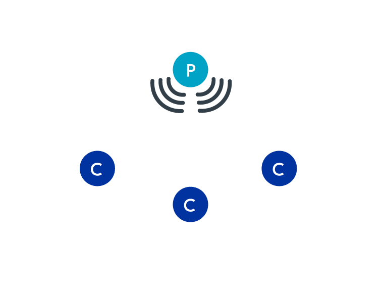
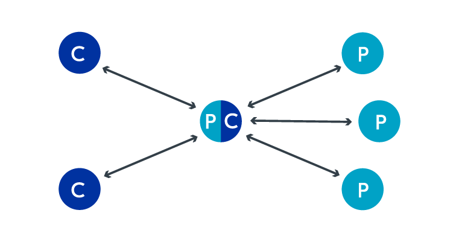

## BLE Protocol Stack

1. Application(应用层)：公司大老板 / 客户最高层
   大老板根本不关心包裹是怎么运的、用了什么卡车。他只负责下达核心业务指令：“现在用户的心率是120次/分，马上把这个数据发给手机！”
2. Host(主机层)：公司总部的“管理与文职部门”

   这一层负责逻辑、安全和打包，主要在处理信息和文件，不负责具体开车跑腿。它包含了几个关键的办公室：

   * GAP (Generic Access Profile) —— 销售与公关部：
     * **职能：** 负责“拉客”和“建立合作”。它决定了你的手环是一直在广播大喊“我在这里，快来连我！”（广播模式），还是悄悄地只和特定的手机握手（连接模式）。
   * GATT & ATT —— 档案与仓库管理部：
     * **职能：** 负责给数据贴标签、分门别类。心率数据不能随便扔，GATT 会把它规范地放进“健康数据档案柜”里的“心率抽屉”（这在蓝牙里叫 Service 和 Characteristic）。ATT 则是那个负责具体去抽屉里存取数据的档案员。
   * SMP (Security Manager Protocol) —— 安保部：
     * **职能：** 负责核对身份和包裹加密。手机连过来时，SMP 会问：“暗号是多少？”（配对/Pairing）。确认安全后，把心率数据放进密码箱，防止被别人中途窃听。
   * L2CAP (Logical Link Control and Adaptation Protocol) —— 包装分发中心：
     * **职能：** 负责把上面送来的包裹进行“拆分”和“合并”。如果大老板扔来一个超大的文件，L2CAP 会把它切成适合卡车装载的小块；同时，它也负责梳理多个部门交接来的包裹，排好队往下送。
3. HCI (Host Controller Interface) —— 内部通讯系统

   图片中间那条虚线，是公司总部（Host）和基层车队（Controller）之间的 **标准通讯接口** 。
   总部在写字楼，车队在郊区车库。HCI 就像是他们之间的“标准指令电话线”或者“快递单发货系统”。总部把打包好的数据通过 HCI 传给车队，车队也会通过 HCI 报告“包裹已送达”。
4. Controller（控制器）：基层“运输车队”

   这一层是纯粹的物理干活部门，不问包裹里是什么，只管把东西安全送过马路。

   * Link Layer (LL - 链路层) —— 车队调度员：
     * **职能：** 负责极其精确的时间管理和交通管制。他决定了卡车必须在 10:00:00 准时出发，10:00:05 准时到达。如果包裹在半路掉了（丢包），他会立刻安排重新发车补送（重传机制）。
   * Physical Layer (PHY - 物理层) —— 卡车与高速公路：
     * **职能：** 最底层的苦力。它是把数据变成 2.4GHz 无线电波发出去的硬件天线。这就好比真正的卡车开在公路上，把包裹（0和1的电信号）物理地运送到手机的接收天线那里。

### 案例：发送一次心率数据

1. **Application:** 手环测出心率 120，大老板下令发送。
2. **GATT/ATT:** 档案员把“120”放进标准的心率数据格式盒子里。
3. **SMP:** 安保部给盒子上了加密锁。
4. **L2CAP:** 包装中心给盒子贴上快递单，装进标准运输箱。
5. **HCI:** 总部通过系统通知车队：“有货要发！”
6. **LL (Link Layer):** 车队调度员安排这批货在接下来的几毫秒内按顺序上车，并盯着对方有没有签收。
7. **PHY (Physical Layer):** 无线电天线化身卡车，通过 2.4GHz 频段，把电信号飞速送到手机端。手机端再由下往上，一层层拆快递，最终在屏幕上显示出“120”。

---

## GAP: Device roles and topologies

蓝牙低功耗协议支持两种不同的通信方式：面向连接的通信和广播通信。

* 面向连接的通信：设备间建立专用连接，形成双向通信。
* 广播通信：设备间不先建立连接，而是通过广播数据包进行通信，范围内的设备均可接收到这些数据包。

广播(**Advertising**)和扫描(**Scanning**)是指蓝牙低功耗 (BLE) 设备感知彼此存在和连接可能性的过程。两个 BLE 设备要相互连接，其中一个需要广播其存在和连接意愿，而另一个则会扫描是否存在此类设备

* 广播：发送广播数据包的过程，其目的既可以是为了广播数据，也可以是为了被其他设备发现。
* 扫描：监听广告数据包的过程

发出连接请求并表明自身存在的设备充当外围设备(**Peripheral**)，而扫描广播的设备则充当中心设备(**Central**)。如果中心设备扫描到外围设备的广播数据包，则可以选择向外围设备发送连接请求来建立连接。此时，就称外围设备和中心设备之间建立了连接。

* 中心设备：一种扫描外围设备并建立连接的设备角色。
* 外围设备：一种能够向中央服务器发布信息并接受连接的设备角色。

有时设备只想广播信息，而无需与其他设备建立连接。在这种情况下，一种称为广播器(**Broadcaster**)的特殊外围设备可以发送广播数据包，但不会接收任何数据包，也不会允许连接请求。信标设备(**Beacon devices**)就是广播器的一个很好的例子。它们只传输信息，无需连接到特定设备。另一方面，一种称为观察者(**Observer**)的特殊中央设备会监听广播数据包，但不会发送连接请求来发起连接。

* 广播器：一种特殊的外部设备，它广播广播数据包而不接受任何连接请求。
* 观察者：一种特殊的中央设备，它监听广播数据包而不主动发起连接。

---

## Network topologies

1. Broadcast topology
   在广播拓扑中，数据传输无需设备间建立连接。这是通过使用广播包将数据广播给范围内所有设备来实现的。外围设备（更具体地说是广播器）广播数据，而中心设备（更具体地说是观察器）扫描并读取广播包中的数据。

   
2. Connected topology

   连通网络拓扑结构在数据传输之前会先建立连接。与广播拓扑结构不同，这种通信方式是双向的。

   
3. Multi-role topology

   单个设备也可以同时扮演多种不同的角色。例如，同一设备在一种环境下可以作为外围设备，而在另一种环境下可以作为中心设备。

   
